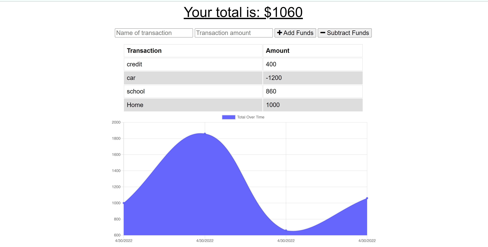

# Easy Budget tracking application

## Demonstration Screenshots

## Purpose
Website/app for tracking expenses and manage money in and out.

## Built With
* 
* 
* 
* 

## Website capabilities
Website/app capable of loading when offline and receive data. After going online the data push to the database, which gives user experience where user doesn't have to worry about bad or no network.

## GitHub Repository Link
https://github.com/TigranBalayan10/easy-budget

## Contribution
Made by Tigran Balayan